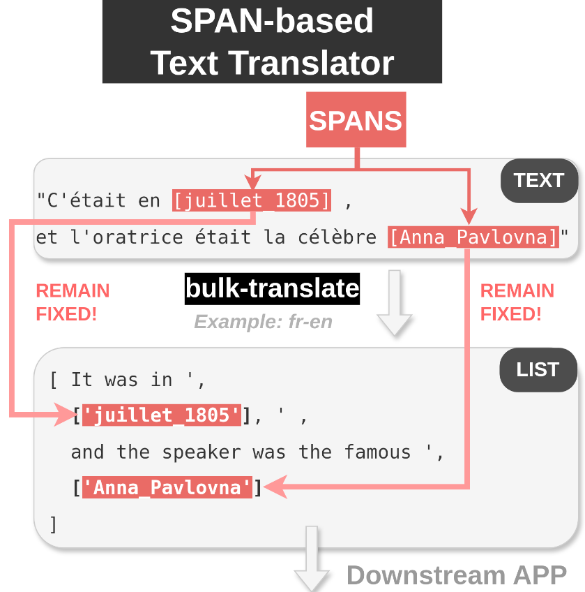

# bulk-translate 0.24.1


[](https://colab.research.google.com/github/nicolay-r/bulk-translate/blob/master/bulk_translate_demo.ipynb)
[](https://pypistats.org/packages/bulk-translate)


A tiny Python no-string package for performing translation of a massive `CSV`/`JSONL` files that 
natively provides support of pre-annotated **fixed-spans** that are invariant for translator.

## Features
  
<details>
<summary>

### 📘 More on spans

</summary>

<p align="center">
    
</p>

</details>

The out-of-the box features of the `bulk-translate` are:
* ✅ Support of the `spans` for annotation / optional translation.
* ✅ Native Implementation of two translation modes:
  - `fast-mode`: exploits extra chars that could be used for grouping all the text parts into single batch with further deconstruction.
  - `accurate`: performs individual translation of each text part.
* ✅ No strings: you're free to adopt any LM / LLM backend.
  - Support `googletrans` by default.

## Installation

```bash
pip install git+https://github.com/nicolay-r/bulk-translate
```

## Usage

### API

Please take a look at the [**related Wiki page**](https://github.com/nicolay-r/bulk-translate/wiki)

### Command Line / Shell 

> **NOTE:** If you wish to translate parse entities, you can use `parse-entities` flag

For the following [`test.tsv` example data](/test/data/test.tsv) with annotated entities enclosed in square brackets:

```bash
python -m bulk_translate.translate \
    --src "test/data/test.tsv" \
    --prompt "{text}" \
    --adapter "dynamic:models/googletrans_310a.py:GoogleTranslateModel" \
    --output "test-translated.jsonl" \
    --parse-entities \
    %%m \
    --src "auto" \
    --dest "ru"
```


## Powered by

* AREkit [[github]](https://github.com/nicolay-r/AREkit)

<p float="left">
<a href="https://github.com/nicolay-r/AREkit"></a>
</p>
